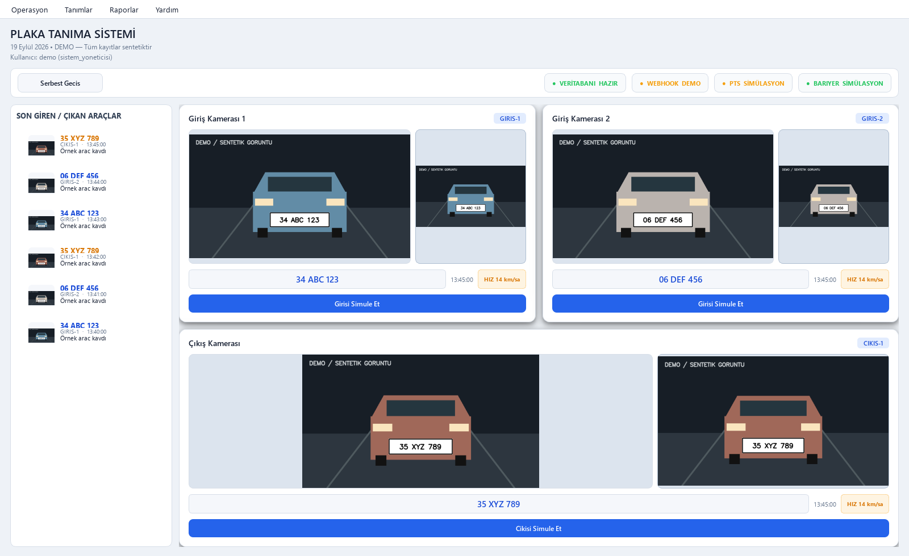
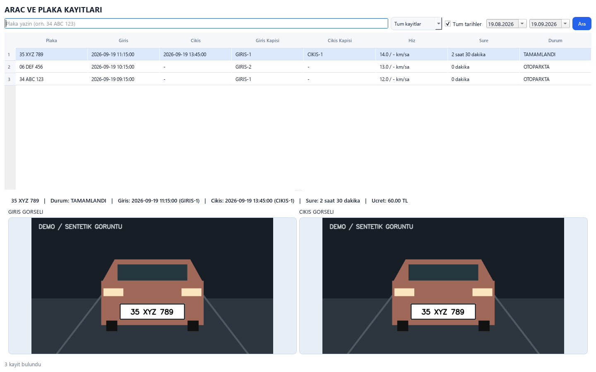

<p align="center"></p>

# Otopark ANPR

**Araç plaka tanıma ve otopark yönetimi için Windows masaüstü uygulaması.**

Python · PySide6 · FastALPR / ONNX · SQLite

İki giriş ve bir çıkış kamerasından gelen olayları tek ekranda takip edin;
park süresini hesaplayın, ödeme alın, aboneleri yönetin ve çıkış bariyerini kontrol edin.
Arayüz Türkçedir. Bu depo, işletmeye özel verilerden arındırılmış genel dağıtımdır.

## Özellikler

| Alan | İşlevler |
| --- | --- |
| Plaka tanıma | FastALPR / ONNX, RTSP, ONVIF keşfi ve HTTP kamera olayları |
| Operasyon | Giriş–çıkış eşleştirme, içerideki araçlar, tekrar olay kontrolü |
| Ödeme | Saatlik tarife, nakit ve diğer ödeme yöntemleri, para üstü, vardiya |
| Üyelik | Abone yönetimi, Excel aktarımı, kara liste |
| Donanım | Simülasyon, seri port, TCP, HTTP, Metcom I/O ve LED tabela sürücüleri |
| Raporlama | Araç/plaka arama, Excel/PDF, zamanlanmış SMTP raporları |
| Yetkilendirme | Kullanıcı rolleri, işlem kayıtları, Windows DPAPI ile cihaz parolaları |
| Görseller | Giriş, çıkış, ödeme ve rapor fotoğraflarında tıklayarak büyütme ve yakınlaştırma |

## Ekran görüntüleri

Görüntüler, uygulamanın gerçek arayüzünden **sentetik plakalar ve çizilmiş örnek karelerle**
üretilmiştir. Gerçek kamera görüntüsü, müşteri kaydı veya tesis bilgisi içermez.



## Hızlı başlangıç — Windows

1. Depoyu ZIP olarak indirin ve yerel bir klasöre çıkarın veya Git ile klonlayın.
2. `kur.bat` dosyasını çalıştırın. Python 3.12, bağımlılıklar ve OCR modelleri için ilk kurulumda internet gerekir.
3. `run.bat` dosyasını çalıştırın.
4. İlk giriş: **admin / admin**. Kendi kurulumunuzda kullanıcı yönetiminden parolayı değiştirin.

İlk açılış **simülasyon modundadır**. Kamera adresleri ve hesapları boştur;
bariyer `MOCK` sürücüsünü kullanır, fiziksel LED ve otomatik e-posta raporları kapalıdır.
Kamera kartlarındaki simülasyon düğmeleri veya simülasyon ekranı ile akışı deneyebilirsiniz.
Bu sürüm bağımsız EXE değildir; kurulum ve başlatma BAT dosyaları ile yapılır.

### Geliştirici kurulumu

```powershell
py -3.12 -m venv .venv
.\.venv\Scripts\python -m pip install -r requirements.txt
Copy-Item .env.example .env
.\.venv\Scripts\python -m app.main
```

## Gerçek cihazları bağlama

1. `.env` içindeki `SIMULATION_MODE=false` değerini ayarlayıp uygulamayı yeniden başlatın.
2. **Tanımlar → Kamera Tanımları** üzerinden kendi IP, ONVIF/RTSP ve hesap bilgilerinizi girin.
3. Bariyer ekranında kendi cihazınızın protokolünü, adresini ve üretici komutlarını yapılandırın.
4. LED tabelayı kendi adresinizle etkinleştirin.
5. SMTP ve rapor alıcılarını kendi hesabınızla yapılandırıp test gönderimi yapın; ardından zamanlamayı etkinleştirin.

Webhook varsayılan olarak yalnız `127.0.0.1:8090` üzerinde dinler.
LAN kameraları için `WEBHOOK_HOST` değerini kendi ağınıza göre değiştirin.
Webhook'ta yerleşik kimlik doğrulama bulunmaz; internetten erişime açmayın,
güvenlik duvarında yalnız yetkili kamera adreslerine izin verin.

Metcom OUT3 örnek komutları her cihaz için genel değildir. Uyumlu donanımda doğruladıktan
sonra `.env` içindeki `METCOM_PROFILE_HOST` alanına kendi cihaz adresinizi girin ve
arayüzde komut doğrulamasını tamamlayın. Yayın sürümü bu komutları kendiliğinden etkinleştirmez.
Bilinmeyen fiziksel kapatma komutu başarılıymış gibi raporlanmaz.

## Veri ve gizlilik

- Kalıcı veriler: `%LOCALAPPDATA%\OtoparkANPRPublic\data`
- Kurulum ortamı: `%LOCALAPPDATA%\OtoparkANPRPublic\runtime`
- Farklı bir veri klasörü için uygulamayı başlatmadan önce `OTOPARK_DATA_DIR` ortam değişkenini ayarlayın.
- `.env`, veritabanları, fotoğraf kayıtları, raporlar, loglar, yedekler ve paketler Git dışında tutulur.
- Örneklerdeki `192.0.2.x` ve `198.51.100.x` adresleri temsili adreslerdir.
- Kamera/SMTP parolaları Windows DPAPI ile saklanır; başka Windows hesabına taşındığında yeniden girilmelidir.

## Testler

```powershell
.\.venv\Scripts\python -m pip install -r requirements-dev.txt
.\.venv\Scripts\python -m pytest -q
```

Testler geçici veritabanları ve taklit donanım kullanır. Fiziksel kamera, bariyer ve
SMTP doğrulaması her kurulumda ayrıca yapılmalıdır. Python testleri Windows üzerinde çalıştırılır.

## Proje yapısı

```text
app/anpr/       Plaka tespit ve OCR
app/services/   Otopark iş akışları, tarifeler, yetkiler
app/ui/         PySide6 masaüstü arayüzü
app/reports/    Raporlar ve zamanlayıcı
app/db.py       SQLite ve veri erişimi
app/barrier.py  Bariyer sürücüleri
tests/          Otomatik testler
tools/          Güvenli demo ekran görüntüsü üretimi
```

## Geliştirme geçmişi

İlk public commit, mevcut geliştirmelerin temizlenmiş güncel sürümüdür.
Önceki çalışmaların özeti [CHANGELOG.md](CHANGELOG.md) içindedir; geriye dönük commit geçmişi üretilmemiştir.

Üçüncü taraf kütüphane ve modeller kendi lisanslarına tabidir. Bu depo için ayrıca
bir açık kaynak lisansı tanımlanmamıştır.
